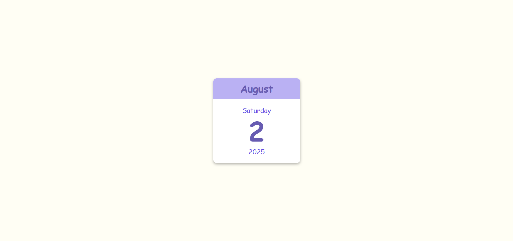

# Web Calendra 📅

**Web Calendra** is a lightweight, browser-based calendar and task manager designed for simplicity and productivity. Built as a college project, it helps users manage events, deadlines, and to-do lists from any device with internet access.

- 
👨‍💻 Author
Virendra D. Verma
<a href="https://www.linkedin.com/in/dharmendraverma95/" target="_blank">🧑‍💻 LinkedIn Profile </a> | <a href="https://www.behance.net/dhirukumar" target="_blank">🧑‍💻 Behance Profile </a>

- 

## 🚀 Features

- 📆 Monthly and weekly calendar view
- ✅ Add, edit, and delete events or tasks
- 🔔 Reminder/alert system (optional feature)
- 🎨 Simple, clean, and responsive UI
- 💻 Works on all modern web browsers

---

## 🛠️ Technologies Used

- **HTML5**
- **CSS3**
- **JavaScript (Vanilla JS or Framework)** – *(specify if using React, Vue, etc.)*
- *(Optional: localStorage or Firebase if you're saving data)*

---

## 📁 Project Structure
WebCalendra/
├── index.html
├── style.css
├── main.js
└── README.md

👉 Desktop Design 
